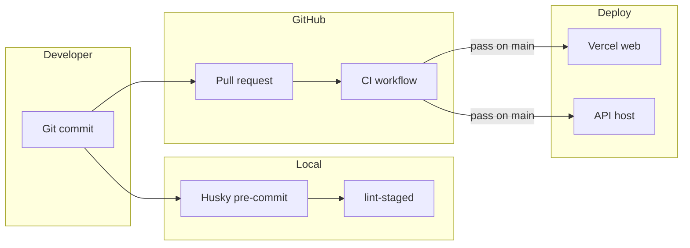

# Deployment Plan

This document outlines how to deploy the **itinerary** Turborepo monorepo.

## Repository layout

| App           | Package     | Default port | Build output |
| ------------- | ----------- | ------------ | ------------ |
| Web (Next.js) | `@repo/web` | 3000         | `.next/`     |
| API (NestJS)  | `@repo/api` | 3001         | `dist/`      |

## Environments

| Environment | Branch               | Purpose                                   |
| ----------- | -------------------- | ----------------------------------------- |
| Preview     | PR branches          | Ephemeral previews for web + optional API |
| Staging     | `develop` (optional) | Pre-production validation                 |
| Production  | `main`               | Live traffic                              |

## Web app (`apps/web`)

### Recommended: Vercel

1. Import the Git repository in [Vercel](https://vercel.com).
2. Set **Root Directory** to the monorepo root (`itinerary` if nested in a parent repo).
3. Configure the project:
   - **Framework Preset**: Next.js
   - **Install Command**: `pnpm install --frozen-lockfile`
   - **Build Command**: `pnpm exec turbo build --filter=@repo/web`
   - **Output Directory**: `apps/web/.next` (or leave default if Vercel detects Next.js in `apps/web`)
4. Set environment variables (see [Environment variables](#environment-variables)).

### Alternatives

- **AWS Amplify**: Point build to `turbo build --filter=@repo/web`, set app root to `apps/web`.
- **Docker**: Multi-stage build from repo root; run `pnpm turbo build --filter=@repo/web` then `next start` in `apps/web`.

## API (`apps/api`)

### Recommended: Railway / Render / Fly.io

1. Create a service from the same Git repository.
2. Set **Root Directory** to monorepo root.
3. Configure:
   - **Install**: `pnpm install --frozen-lockfile`
   - **Build**: `pnpm exec turbo build --filter=@repo/api`
   - **Start**: `node apps/api/dist/main.js` (or `pnpm --filter @repo/api start:prod`)
4. Expose port `3001` (or map platform `PORT` env — Nest reads `process.env.PORT`).

### AWS (ECS / EKS)

1. Build a Docker image:
   - Stage 1: install deps and `turbo build --filter=@repo/api`
   - Stage 2: slim Node image, copy `apps/api/dist` and production `node_modules`
2. Run behind an ALB with health check on `GET /`.
3. Store secrets in AWS Secrets Manager / SSM Parameter Store.

### Alternatives

- **Google Cloud Run**: Containerized NestJS; scale to zero for low traffic.
- **Azure Container Apps**: Same pattern as Cloud Run.

## Environment variables

### Web (`apps/web`)

| Variable              | Required   | Description                                                 |
| --------------------- | ---------- | ----------------------------------------------------------- |
| `NEXT_PUBLIC_API_URL` | Yes (prod) | Base URL of the NestJS API (e.g. `https://api.example.com`) |

### API (`apps/api`)

| Variable       | Required   | Description                  |
| -------------- | ---------- | ---------------------------- |
| `PORT`         | No         | Listen port (default `3001`) |
| `NODE_ENV`     | Yes        | `production` in prod         |
| `DATABASE_URL` | When added | Database connection string   |
| `JWT_SECRET`   | When added | Auth signing secret          |

Use platform secret managers (Vercel Env, Railway Variables, AWS Secrets Manager). Do not commit `.env` files.

## CI/CD flow

1. **Pre-commit** (Husky): `lint-staged` runs Prettier + ESLint on staged files.
2. **CI** (`.github/workflows/ci.yml`): `lint` → `check-types` → `test` → `build` on every push/PR.
3. **Deploy triggers**:
   - Connect Vercel to `main` for automatic web deploys.
   - Connect API platform to `main` (or tag releases) for API deploys.
   - Optionally add `.github/workflows/deploy.yml` for custom pipelines (ECS, etc.).

## Turborepo in CI and deploy

- Use `pnpm exec turbo run <task> --filter=<package>` to build only what changed.
- Enable [Remote Caching](https://turborepo.dev/docs/core-concepts/remote-caching) on Vercel or with `turbo login` + `TURBO_TOKEN` in CI for faster builds.

## Rollback

- **Vercel**: Promote a previous deployment from the dashboard.
- **Container hosts**: Redeploy previous image digest or git SHA.
- **Database**: Use migration rollback strategy before redeploying old API versions.

## Checklist before first production deploy

- [ ] `NEXT_PUBLIC_API_URL` points to production API
- [ ] API CORS allows production web origin
- [ ] Health check configured (`GET /` on API)
- [ ] Secrets set in platform (not in git)
- [ ] CI green on `main`
- [ ] Custom domain + TLS configured
